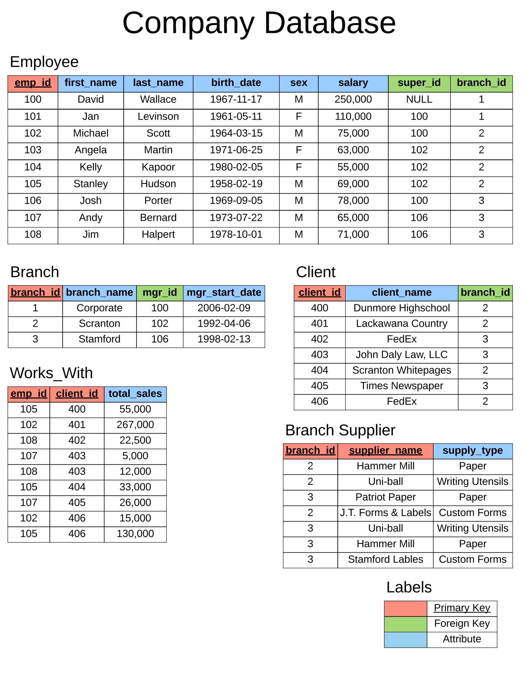
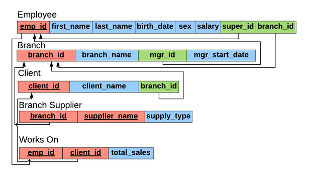

# Company DataBase

Database Schema 
: refers to the structure or blueprint of a database. It defines how the data is organized, the relationships between different data elements, and the constraints and rules that govern the data.

___

**TASK 1** : creating company database.

**TASK 2** : inserting data/information.

**TASK 3** : write Queries to get the specific data mentioned below. 
Q1) Find all employees 
Q2) Find all clients 
Q3) Find all employees ordered by salary 
Q4) Find all employees ordered by sex then name 
Q5) Find the first 5 employees in the table 
Q6) Find the first and last names of all employees 
Q7) Find the forename and surnames names of all employees 
Q8) Find out all the different genders 
Q9) Find all male employees 
Q10) Find all employees at branch 2 
Q11) Find all employee's id's and names who were born after 1969 
Q12) Find all female employees at branch 2 
Q13) Find all employees who are female & born after 1969 or who make over 80000 
Q14) Find all employees born between 1970 and 1975 
Q15) Find all employees named Jim, Michael, Johnny or David 
Q16) Find the number of employees 
Q17) Find the average of all employee's salaries 
Q18) Find the sum of all employee's salaries 
Q19) Find out how many males and females there are 
Q20) Find the total sales of each salesman 
Q21) Find the total amount of money spent by each client 
Q22) Find any client's who are an LLC 
Q23) Find any branch suppliers who are in the label business 
Q24) Find any employee born on the 10th day of the month 
Q25) Find any clients who are schools 
Q26) Find a list of employee and branch names 
Q27) Find a list of all clients & branch suppliers' names 
Q28) Find all branches and the name of their managers 
Q29) Find names of all employees who have sold over 50,000 
Q30) Find all clients who are handles by the branch that Michael Scott manages 
Q31) Find the names of employees who work with clients handled by the scranton branch 
Q32) Find the names of all clients who have spent more than 100,000 dollars 

___

check out 

___

**ER Diagram Template**

**Company Data Storage Requirements**

The company is organized into branches. Each branch has a unique number, a name, and a particular employee who manages it.

The company makes it’s money by selling to clients. Each client has a name and a unique number to identify it.

The foundation of the company is it’s employees. Each employee has a name, birthday, sex, salary and a unique number.

An employee can work for one branch at a time, and each branch will be managed by one of the employees that work there. We’ll also want to keep track of when the current manager started as manager.

An employee can act as a supervisor for other employees at the branch, an employee may also act as the supervisor for employees at other branches. An employee can have at most one supervisor.

A branch may handle a number of clients, with each client having a name and a unique number to identify it. A single client may only be handled by one branch at a time.

Employees can work with clients controlled by their branch to sell them stuff. If nescessary multiple employees can work with the same client. We’ll want to keep track of how many dollars worth of stuff each employee sells to each client they work with.

Many branches will need to work with suppliers to buy inventory. For each supplier we’ll keep track of their name and the type of product they’re selling the branch. A single supplier may supply products to multiple branches.

**Company ER Diagram**

**Company database schema**

